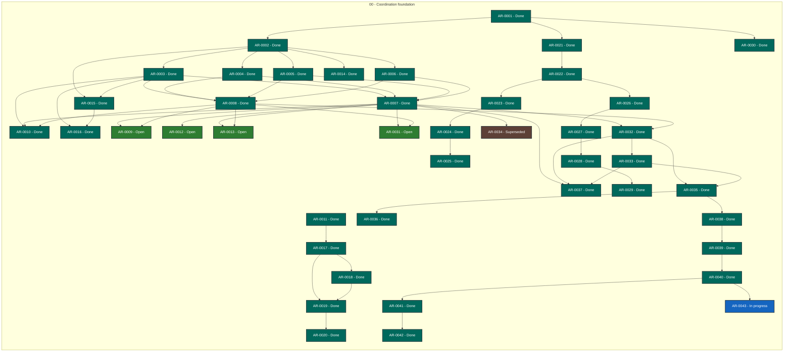

# Agent Workflow Coordinator status

> Generated deterministically from task front matter. Do not edit this file directly.
> Status records coordination progress; it is not evidence that product behavior is accepted.

## Portfolio overview

**43 ARs tracked** across 4 active status categories.

| Status | Meaning | Count |
| --- | --- | ---: |
| **In progress** | Claimed work with a live lease | 1 |
| **Open** | Dependency-ready and available to claim | 4 |
| **Blocked** | Cannot proceed until its recorded blocker clears | 0 |
| **Planned** | Defined work awaiting promotion or dependencies | 0 |
| **Future** | Deferred roadmap work | 0 |
| **Done** | Accepted, integrated, and durably verified | 37 |
| **Cancelled** | Stopped with a recorded rationale | 0 |
| **Superseded** | Replaced by another AR | 1 |

## Dependency graph

Arrows point from each prerequisite to the work that depends on it. Color is redundant
with the status text inside every node; the tables below are the complete text
alternative.

### Accessible dependency index

| AR | Prerequisites | Dependents |
| --- | --- | --- |
| [AR-0001](tasks/AR-0001.md) | None | [AR-0002](tasks/AR-0002.md), [AR-0021](tasks/AR-0021.md), [AR-0030](tasks/AR-0030.md) |
| [AR-0002](tasks/AR-0002.md) | [AR-0001](tasks/AR-0001.md) | [AR-0003](tasks/AR-0003.md), [AR-0004](tasks/AR-0004.md), [AR-0005](tasks/AR-0005.md), [AR-0006](tasks/AR-0006.md), [AR-0014](tasks/AR-0014-verified-supersession-dependencies.md), [AR-0015](tasks/AR-0015-vendor-formal-runtime-closure.md) |
| [AR-0003](tasks/AR-0003.md) | [AR-0002](tasks/AR-0002.md) | [AR-0007](tasks/AR-0007.md), [AR-0008](tasks/AR-0008.md), [AR-0010](tasks/AR-0010.md), [AR-0015](tasks/AR-0015-vendor-formal-runtime-closure.md), [AR-0016](tasks/AR-0016-release-validation-dispatch.md) |
| [AR-0004](tasks/AR-0004.md) | [AR-0002](tasks/AR-0002.md) | [AR-0007](tasks/AR-0007.md), [AR-0008](tasks/AR-0008.md) |
| [AR-0005](tasks/AR-0005.md) | [AR-0002](tasks/AR-0002.md) | [AR-0007](tasks/AR-0007.md), [AR-0008](tasks/AR-0008.md) |
| [AR-0006](tasks/AR-0006.md) | [AR-0002](tasks/AR-0002.md) | [AR-0007](tasks/AR-0007.md), [AR-0008](tasks/AR-0008.md) |
| [AR-0007](tasks/AR-0007.md) | [AR-0003](tasks/AR-0003.md), [AR-0004](tasks/AR-0004.md), [AR-0005](tasks/AR-0005.md), [AR-0006](tasks/AR-0006.md) | [AR-0009](tasks/AR-0009.md), [AR-0010](tasks/AR-0010.md), [AR-0012](tasks/AR-0012.md), [AR-0013](tasks/AR-0013.md), [AR-0031](tasks/AR-0031.md), [AR-0032](tasks/AR-0032.md), [AR-0034](tasks/AR-0034.md), [AR-0037](tasks/AR-0037.md) |
| [AR-0008](tasks/AR-0008.md) | [AR-0003](tasks/AR-0003.md), [AR-0004](tasks/AR-0004.md), [AR-0005](tasks/AR-0005.md), [AR-0006](tasks/AR-0006.md) | [AR-0009](tasks/AR-0009.md), [AR-0010](tasks/AR-0010.md), [AR-0013](tasks/AR-0013.md), [AR-0031](tasks/AR-0031.md), [AR-0032](tasks/AR-0032.md) |
| [AR-0009](tasks/AR-0009.md) | [AR-0007](tasks/AR-0007.md), [AR-0008](tasks/AR-0008.md) | None |
| [AR-0010](tasks/AR-0010.md) | [AR-0003](tasks/AR-0003.md), [AR-0007](tasks/AR-0007.md), [AR-0008](tasks/AR-0008.md) | None |
| [AR-0011](tasks/AR-0011.md) | None | [AR-0017](tasks/AR-0017.md) |
| [AR-0012](tasks/AR-0012.md) | [AR-0007](tasks/AR-0007.md) | None |
| [AR-0013](tasks/AR-0013.md) | [AR-0007](tasks/AR-0007.md), [AR-0008](tasks/AR-0008.md) | None |
| [AR-0014](tasks/AR-0014-verified-supersession-dependencies.md) | [AR-0002](tasks/AR-0002.md) | None |
| [AR-0015](tasks/AR-0015-vendor-formal-runtime-closure.md) | [AR-0002](tasks/AR-0002.md), [AR-0003](tasks/AR-0003.md) | [AR-0016](tasks/AR-0016-release-validation-dispatch.md) |
| [AR-0016](tasks/AR-0016-release-validation-dispatch.md) | [AR-0003](tasks/AR-0003.md), [AR-0015](tasks/AR-0015-vendor-formal-runtime-closure.md) | None |
| [AR-0017](tasks/AR-0017.md) | [AR-0011](tasks/AR-0011.md) | [AR-0018](tasks/AR-0018.md), [AR-0019](tasks/AR-0019.md) |
| [AR-0018](tasks/AR-0018.md) | [AR-0017](tasks/AR-0017.md) | [AR-0019](tasks/AR-0019.md) |
| [AR-0019](tasks/AR-0019.md) | [AR-0017](tasks/AR-0017.md), [AR-0018](tasks/AR-0018.md) | [AR-0020](tasks/AR-0020.md) |
| [AR-0020](tasks/AR-0020.md) | [AR-0019](tasks/AR-0019.md) | None |
| [AR-0021](tasks/AR-0021.md) | [AR-0001](tasks/AR-0001.md) | [AR-0022](tasks/AR-0022.md) |
| [AR-0022](tasks/AR-0022.md) | [AR-0021](tasks/AR-0021.md) | [AR-0023](tasks/AR-0023.md), [AR-0026](tasks/AR-0026.md) |
| [AR-0023](tasks/AR-0023.md) | [AR-0022](tasks/AR-0022.md) | [AR-0024](tasks/AR-0024.md) |
| [AR-0024](tasks/AR-0024.md) | [AR-0023](tasks/AR-0023.md) | [AR-0025](tasks/AR-0025.md) |
| [AR-0025](tasks/AR-0025.md) | [AR-0024](tasks/AR-0024.md) | None |
| [AR-0026](tasks/AR-0026.md) | [AR-0022](tasks/AR-0022.md) | [AR-0027](tasks/AR-0027.md) |
| [AR-0027](tasks/AR-0027.md) | [AR-0026](tasks/AR-0026.md) | [AR-0028](tasks/AR-0028.md) |
| [AR-0028](tasks/AR-0028.md) | [AR-0027](tasks/AR-0027.md) | [AR-0029](tasks/AR-0029.md) |
| [AR-0029](tasks/AR-0029.md) | [AR-0028](tasks/AR-0028.md) | None |
| [AR-0030](tasks/AR-0030.md) | [AR-0001](tasks/AR-0001.md) | None |
| [AR-0031](tasks/AR-0031.md) | [AR-0007](tasks/AR-0007.md), [AR-0008](tasks/AR-0008.md) | None |
| [AR-0032](tasks/AR-0032.md) | [AR-0007](tasks/AR-0007.md), [AR-0008](tasks/AR-0008.md) | [AR-0033](tasks/AR-0033.md), [AR-0035](tasks/AR-0035.md), [AR-0037](tasks/AR-0037.md) |
| [AR-0033](tasks/AR-0033.md) | [AR-0032](tasks/AR-0032.md) | [AR-0035](tasks/AR-0035.md), [AR-0037](tasks/AR-0037.md) |
| [AR-0034](tasks/AR-0034.md) | [AR-0007](tasks/AR-0007.md) | None |
| [AR-0035](tasks/AR-0035.md) | [AR-0032](tasks/AR-0032.md), [AR-0033](tasks/AR-0033.md) | [AR-0036](tasks/AR-0036.md), [AR-0038](tasks/AR-0038.md) |
| [AR-0036](tasks/AR-0036.md) | [AR-0035](tasks/AR-0035.md) | None |
| [AR-0037](tasks/AR-0037.md) | [AR-0007](tasks/AR-0007.md), [AR-0032](tasks/AR-0032.md), [AR-0033](tasks/AR-0033.md) | None |
| [AR-0038](tasks/AR-0038.md) | [AR-0035](tasks/AR-0035.md) | [AR-0039](tasks/AR-0039.md) |
| [AR-0039](tasks/AR-0039.md) | [AR-0038](tasks/AR-0038.md) | [AR-0040](tasks/AR-0040.md) |
| [AR-0040](tasks/AR-0040.md) | [AR-0039](tasks/AR-0039.md) | [AR-0041](tasks/AR-0041.md), [AR-0043](tasks/AR-0043.md) |
| [AR-0041](tasks/AR-0041.md) | [AR-0040](tasks/AR-0040.md) | [AR-0042](tasks/AR-0042.md) |
| [AR-0042](tasks/AR-0042.md) | [AR-0041](tasks/AR-0041.md) | None |
| [AR-0043](tasks/AR-0043.md) | [AR-0040](tasks/AR-0040.md) | None |

## Complete AR inventory

### In progress (1)

| Priority | AR | Owner | Summary | Next action |
| --- | --- | --- | --- | --- |
| P0 | [AR-0043](tasks/AR-0043.md): Bind process-death barrier evidence to the formal contract | codex-root | AR-0012 has route and provisioning evidence, but the v10 contract still lacks exact process-death/refinement binding for every durable barrier transition. Add bounded hostile evidence without claiming mathematical Python/TLA refinement or enabling mutation. | Monitor PR #880 checks and exact-head review; merge only after gates, run post-merge Verify, then reconcile state. |

### Open (4)

| Priority | AR | Owner | Summary | Next action |
| --- | --- | --- | --- | --- |
| P0 | [AR-0009](tasks/AR-0009.md): Release integration and first upgrade | Unclaimed | Exact product main 30ed06f release-readiness audit: 45 release identity/workflow/runbook/contract/generator/command tests passed with 81 subtests. Unsigned lightweight tag policy is explicit and hostile-tested; workflow validates candidate identity, fresh-clone contract/runbook determinism, source binding, artifact ownership/digests, and emits non-publishing tag commands. No new dependency-safe release seam found. | Keep AR-0009 open for a genuinely uncovered release-integration/readiness boundary; do not add signing gates or signing prerequisites. |
| P0 | [AR-0012](tasks/AR-0012.md): Durable upgrade barrier and SQLite write fencing | Unclaimed | Exact main 30ed06f recovery-chain hostile matrix passed 267 tests and 105 subtests across SQLite authority adapter, storage, rollback control store, lock scope, and upgrade authority. Existing failure coverage remains complete; no new dependency-safe barrier/fencing seam found without enabling mutation or dispatch. | Bind the exact post-AR-0039 implementation route inventory and crash/recovery evidence to the v10 refinement contract; do not claim full Python refinement or enable upgrade apply/rollback. |
| P0 | [AR-0013](tasks/AR-0013.md): Selector-aware authenticated versioned runtime | Unclaimed | Exact main 30ed06f recovery-chain selector/runtime matrix passed 227 tests and 265 subtests across runtime bootstrap, selector authority/recovery, admission, engine, identity, campaign, contract, runbook, and lock scope. Existing hostile coverage remains complete; no new dependency-safe non-overlapping selector/runtime seam found without enabling mutation or dispatch. | Keep AR-0013 open for a genuinely uncovered selector/versioned-runtime correctness boundary after future merges; preserve fail-closed mutation and dispatch. |
| P0 | [AR-0031](tasks/AR-0031.md): Executable upgrade mutation and rollback boundary | Unclaimed | PR #735 adds bounded, machine-checked formal correspondence scaffolding for SQLite snapshot/identity reread, read-close uncertainty, and permanent ambiguous fencing. It preserves the rejection-only mutation gate. | Implement the first bounded authority-neutral executor seam using AR-0032/0033 validated chains; keep mutation and dispatch disabled until barrier, selector, hostile process-death, and formal gates pass. |

### Done (37)

| Priority | AR | Owner | Summary | Next action |
| --- | --- | --- | --- | --- |
| P0 | [AR-0001](tasks/AR-0001.md): Integrate AWQ v0.32.0 into the coordinator | Unclaimed | Adopt AWQ v0.32.0 while retaining coordinator-native quality and formal gates. | Merged PR #20 at merge commit 713761b; post-merge AWQ PR check passes; no coordinator release was published by this merge. |
| P0 | [AR-0002](tasks/AR-0002.md): Correctness-first coordinator upgrade protocol | Unclaimed | Define a correctness-first coordinator release upgrade with verified backup and rollback. | Merged PR #21 at bd070596729949a77cfb4fae7c4230055f3f4ece. Post-merge AWQ and focused contract verification pass; no coordinator release published. AR-0011 remains the next open child. |
| P0 | [AR-0003](tasks/AR-0003.md): Release-upgrade contract and generator | Unclaimed | Generate and validate complete, bounded upgrade instructions for every release. | PR #23 at 736d2e2 is published; await exact-head verify run 34784319165 and independent review before merge. |
| P0 | [AR-0004](tasks/AR-0004.md): Quiescence and upgrade preflight | Unclaimed | Prevent upgrades from starting unless the coordination system can remain safe and functional. | AR-0004 complete; PR #24 merged and post-merge main verification green. AR-0007 is now dependency-ready for phase-machine implementation. |
| P0 | [AR-0005](tasks/AR-0005.md): Git-backend backup and restore | Unclaimed | Back up and restore complete Git-backed coordination state without losing task history. | AR-0005 complete; PR #25 merged and post-merge main verification green. AR-0006 PR #26 remains open pending independent review and exact-head checks. |
| P0 | [AR-0006](tasks/AR-0006.md): SQLite backup, migration, and restore | Unclaimed | Preserve SQLite authority and recoverability through coordinator upgrades and migrations. | AR-0006 complete; PR #26 merged and post-merge main verification green. AR-0004 remains blocked pending its correctness fixes and healthy exact-head rerun. |
| P0 | [AR-0007](tasks/AR-0007.md): Upgrade engine and rollback | Unclaimed | PR445 merged as d521ad0; post-merge Verify 35096212760 passed; worker auditing remaining AR-0007 rollback/restore gaps | Identify next non-duplicate AR-0007 contract gap beyond control-store identity tests; publish only after focused validation and independent review |
| P0 | [AR-0008](tasks/AR-0008.md): Formal upgrade and recovery model | Unclaimed | PR #323 adds RollbackRequiresBackup invariant on exact main 143bdf6; hosted Verify is pending and local TLC was blocked by pthread_create EAGAIN. | Await exact-head Verify and artifact; independently review the result before merge. Preserve bounded-model and implementation-refinement nonclaims. |
| P0 | [AR-0011](tasks/AR-0011.md): Bounded TLA+ execution and admission safety | Unclaimed | Exact-head PR #22 formal publication gate independently reviewed green. | Await parent merge decision; retain full-exhaustive claims for successful scheduled/manual run and preserve merge-tree attestation provenance. |
| P0 | [AR-0014](tasks/AR-0014-verified-supersession-dependencies.md): Verified supersession dependency readiness | Unclaimed | Make explicitly verified superseded tasks satisfy dependencies only through a completed successor. | Coordinator v0.3.6 is published and signed at a1bc4459f884ce447e8ee2884df12ea3ff4b710b. Future supersession tests/features must be added through this canonical coordinator-state handoffctl path; downstream vendor synchronization is intentionally removed. |
| P0 | [AR-0017](tasks/AR-0017.md): TLC resource-bound reliability | Unclaimed | PR #319 exact signed head 16a3549 includes capacity/preflight, timeout/doc repairs, and YAML syntax fix; Verify 35024077568 is running with AWQ/scope green and formal pending. | Await terminal Verify 35024077568 including 6000-second release-sensitive TLC, attestation and DCO; then independently review and merge only with post-merge Verify. |
| P0 | [AR-0018](tasks/AR-0018.md): Formal attestation resource-bound consistency | Unclaimed | Align formal attestation resource_bounds with the actual workflow-enforced TLC profile; prevent publication of contradictory evidence. | Implement bound derivation in attest.py, add tier-specific regression tests, publish an exact-head PR, and require green post-merge Verify. |
| P0 | [AR-0020](tasks/AR-0020.md): Correct formal tier policy for merge and advisory exhaustive runs | Unclaimed | Correct post-merge and sustained formal verification tier policy without weakening release evidence. | Correct formal tier dispatch so post-merge push verification uses required pr-fast, while scheduled and manually dispatched full-exhaustive runs remain advisory; preserve release-sensitive publication gates. |
| P0 | [AR-0022](tasks/AR-0022.md): Mandatory oracle interaction-gate lifecycle | Unclaimed | Make user interaction gates first-class Coordinator task events and non-skippable lifecycle states. | Add a typed Coordinator lifecycle for mandatory intake, discussion, specification-review, and reconciliation interaction gates. |
| P0 | [AR-0023](tasks/AR-0023.md): Versioned planning and design artifact binding | Unclaimed | Make before/after project artifacts durable and revision-bound around user discussions. | Bind versioned work-plan, design-document, dependency-graph, AR-manifest, and formal-specification snapshots to Coordinator task revisions. |
| P0 | [AR-0024](tasks/AR-0024.md): Discussion pause and reconciliation enforcement | Unclaimed | Prevent unresolved or contradictory user guidance from authorizing Coordinator continuation. | Enforce pause, user disposition, contradiction reopen, and repeated-discussion transitions before autonomous continuation. |
| P0 | [AR-0026](tasks/AR-0026.md): Discussion TUI session and task-event binding | Unclaimed | Bind the reusable discussion TUI session to Coordinator task state. | Define revision-bound discussion-session events for TUI entry, active point, document anchor, user response, and unresolved status. |
| P0 | [AR-0027](tasks/AR-0027.md): Batched TUI packet and navigation binding | Unclaimed | Persist TUI navigation and batch-point state without cross-point authorization. | Bind batched discussion packets, per-point response state, active UI anchors, and optional re-ask markers to task revisions. |
| P0 | [AR-0028](tasks/AR-0028.md): TUI safe exit and future-discussion persistence | Unclaimed | Ensure TUI sessions cannot lose decisions or future discussion requests. | Implement atomic safe-exit, resume, re-ask, and future-discussion AR mapping events for TUI sessions. |
| P0 | [AR-0030](tasks/AR-0030.md): Integrate AWQ v0.35.0 trust and quality gates | Unclaimed | Upgrade the Coordinator to the latest AWQ v0.35.0 release without dropping native formal or release-sensitive gates. | Await independent exact-head review of PR #723 at a85a58035c843f67614f29059c364d506645987f; do not merge until review and hosted evidence are recorded. |
| P0 | [AR-0032](tasks/AR-0032.md): Multi-revision durable session identity contract | Unclaimed | Additive durable session identity and journal-chain contract required to unblock AR-0031 without weakening fail-closed upgrade behavior. | Implement and formally validate the additive multi-revision durable session and journal-chain contract before enabling any upgrade mutation or dispatch. |
| P0 | [AR-0033](tasks/AR-0033.md): Integrate session chain with durable contract | Unclaimed | Wire AR-0032 chain validation into the durable session contract without enabling mutation or dispatch. | Integrate the validated multi-revision session chain with the existing durable session contract as a read-only admission seam. |
| P0 | [AR-0035](tasks/AR-0035.md): Bounded backup-only executor seam | Unclaimed | First bounded executable upgrade slice: durable, fenced backup only, with no runtime replacement or dispatch. | Implement a backup-only generated operation behind the validated session/barrier seam; leave stage, commit, validate, reopen, rollback, and dispatch fail-closed. |
| P0 | [AR-0036](tasks/AR-0036.md): Git backup-only executor parity | Unclaimed | Provide parity for the bounded backup-only executor on the Git authority backend. | Add the Git equivalent of the bounded generated backup operation with owned lifecycle/session identity and fail-closed unsupported opcodes. |
| P0 | [AR-0037](tasks/AR-0037.md): Restore branch coverage gate after Git executor merge | Unclaimed | Repair the post-merge Verify coverage regression introduced by the Git backup executor and session-chain integration. | Raise exact-head branch coverage back above the 95&#37; gate with behavior-focused tests for new Git executor and session-chain rejection branches. |
| P0 | [AR-0038](tasks/AR-0038.md): Bind public SQLite mutation routes to the durable barrier | Unclaimed | The durable SQLite mutation fence is implemented and hostile-tested, but handoffctl production routes still construct an unbound SQLiteBackend and bypass that fence. | Bind every production handoffctl SQLite mutation route to the provisioned common/control/authority fence without changing read-only or legacy Git behavior. |
| P0 | [AR-0039](tasks/AR-0039.md): Provision the SQLite barrier baseline | Unclaimed | AR-0038 binds provisioned routes, but init and migration do not yet create the compatibility marker, control store, and released barrier baseline required for safe public SQLite writes. | Provision the SQLite authority/control marker and an auditable released baseline during init and Git-to-SQLite migration. |
| P0 | [AR-0040](tasks/AR-0040.md): Bind SQLite barrier evidence to the refinement contract | Unclaimed | The executable barrier and provisioning evidence is merged, but the formal contract still records implementation refinement as pending and does not enumerate the new public route binding and baseline provisioning. | Bind the exact fenced SQLite route inventory and crash/recovery tests to the v10 refinement contract without claiming unproved Python equivalence. |
| P0 | [AR-0041](tasks/AR-0041.md): Bind authenticated runtime admission to a fixed launcher entrypoint | Unclaimed | Runtime selector resolution and retained identity validation exist, but no consumer binds the admitted runtime to a stable fixed entrypoint; subsequent invocations can still use the adjacent runtime. | Monitor PR #878 hosted checks and independent review; repair any findings, merge only at exact reviewed head, then run post-merge Verify and reconcile state. |
| P0 | [AR-0042](tasks/AR-0042.md): Bind fixed runtime dispatch to the production consumer | Unclaimed | AR-0041 provides a safe descriptor-backed command builder, but the coordinator upgrade/runtime call graph does not yet consume it. Bind one fixed consumer with subprocess descriptor inheritance, revalidation, and failure classification without enabling mutation. | Monitor PR #879 hosted checks and exact-head review; repair findings, merge, run post-merge Verify, then reconcile state. |
| P1 | [AR-0010](tasks/AR-0010.md): Operational upgrade runbooks and generated release steps | Unclaimed | Make every release&#x27;s prerequisites, steps, evidence, and rollback path explicit and safe to operate. | Add targeted generator/verifier branch tests, rerun full coverage to &gt;=95&#37;, obtain new exact-head review and hosted green gates. |
| P1 | [AR-0015](tasks/AR-0015-vendor-formal-runtime-closure.md): Complete formal runtime vendor closure | Unclaimed | PR #309 merged at 6332f032b7445b8a02f60fdf99113d0d835de29e; post-merge Verify 34997001352 failed only formal evidence hash consistency: tools/handoffctl.py changed for v0.3.8 but formal/evidence.json retains prior digest. 512 tests executed; AWQ/scope passed. Existing v0.3.7 immutable tag remains untouched; no release published. | Repair formal/evidence.json using the canonical evidence generator from exact merge 6332f032; obtain independent review and green exact-head Verify, then publish signed immutable v0.3.8 targeting the repaired merge. |
| P1 | [AR-0016](tasks/AR-0016-release-validation-dispatch.md): Release validation dispatch gate | Unclaimed | Release-validation dispatch evidence is complete: merged PR #314 and successful exact-head full run on b097c757. | Release AR-0016 after recording exact PR/run/artifact evidence; retain AR-0007 open for executable rollback criteria. |
| P1 | [AR-0019](tasks/AR-0019.md): Fast merge formal tier and weekly exhaustive run | Unclaimed | Separate fast merge/commit formal checks from weekly full-exhaustive TLC without weakening release or publication evidence. | Specify and implement a bounded fast merge TLC tier, retain weekly full-exhaustive execution as advisory, and preserve release evidence requirements. |
| P1 | [AR-0021](tasks/AR-0021.md): Reconcile issue #14 with verified AWQ adoption | Unclaimed | Issue #14 reconciled: AR-0001 and PR #20 already delivered the requested artifacts and profiles using newer AWQ v0.32.0; no duplicate or downgrade was needed. | Closed issue #14 after verified supersession; retain AR-0001 as the implementation record. |
| P1 | [AR-0025](tasks/AR-0025.md): Cross-project oracle workflow integration | Unclaimed | Prove the three-project oracle workflow integrates without duplicated authority or bypasses. | Run the synthetic end-to-end Coordinator/AWG/AWQ workflow and publish the integration contract and evidence boundaries. |
| P1 | [AR-0029](tasks/AR-0029.md): TUI cross-project integration acceptance | Unclaimed | Accept the reusable discussion TUI only through the three-project integration contract. | Run the complete AWG TUI session through Coordinator and AWQ contracts for both agent- and user-initiated discussions. |

### Superseded (1)

| Priority | AR | Owner | Summary | Next action |
| --- | --- | --- | --- | --- |
| P1 | [AR-0034](tasks/AR-0034.md): Close SQLite barrier observation connections | Unclaimed | Repair leaked SQLite connections observed during the AR-0012 hostile barrier matrix. | Close every SQLite connection opened by barrier/control-store observations and add regression checks with warnings treated as failures. |
