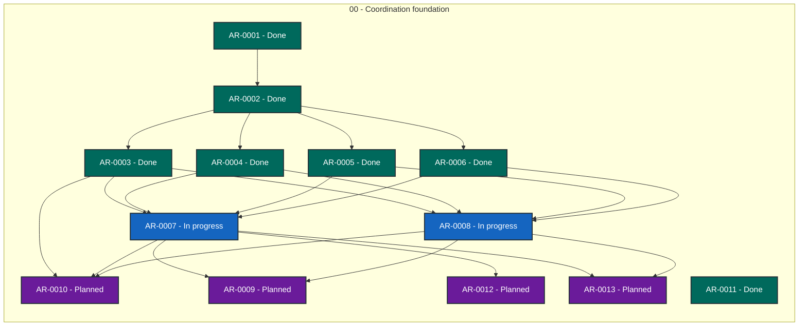

# Agent Workflow Coordinator status

> Generated deterministically from task front matter. Do not edit this file directly.
> Status records coordination progress; it is not evidence that product behavior is accepted.

## Portfolio overview

**13 ARs tracked** across 3 active status categories.

| Status | Meaning | Count |
| --- | --- | ---: |
| **In progress** | Claimed work with a live lease | 2 |
| **Open** | Dependency-ready and available to claim | 0 |
| **Blocked** | Cannot proceed until its recorded blocker clears | 0 |
| **Planned** | Defined work awaiting promotion or dependencies | 4 |
| **Future** | Deferred roadmap work | 0 |
| **Done** | Accepted, integrated, and durably verified | 7 |
| **Cancelled** | Stopped with a recorded rationale | 0 |
| **Superseded** | Replaced by another AR | 0 |

## Dependency graph

Arrows point from each prerequisite to the work that depends on it. Color is redundant
with the status text inside every node; the tables below are the complete text
alternative.

### Accessible dependency index

| AR | Prerequisites | Dependents |
| --- | --- | --- |
| [AR-0001](tasks/AR-0001.md) | None | [AR-0002](tasks/AR-0002.md) |
| [AR-0002](tasks/AR-0002.md) | [AR-0001](tasks/AR-0001.md) | [AR-0003](tasks/AR-0003.md), [AR-0004](tasks/AR-0004.md), [AR-0005](tasks/AR-0005.md), [AR-0006](tasks/AR-0006.md) |
| [AR-0003](tasks/AR-0003.md) | [AR-0002](tasks/AR-0002.md) | [AR-0007](tasks/AR-0007.md), [AR-0008](tasks/AR-0008.md), [AR-0010](tasks/AR-0010.md) |
| [AR-0004](tasks/AR-0004.md) | [AR-0002](tasks/AR-0002.md) | [AR-0007](tasks/AR-0007.md), [AR-0008](tasks/AR-0008.md) |
| [AR-0005](tasks/AR-0005.md) | [AR-0002](tasks/AR-0002.md) | [AR-0007](tasks/AR-0007.md), [AR-0008](tasks/AR-0008.md) |
| [AR-0006](tasks/AR-0006.md) | [AR-0002](tasks/AR-0002.md) | [AR-0007](tasks/AR-0007.md), [AR-0008](tasks/AR-0008.md) |
| [AR-0007](tasks/AR-0007.md) | [AR-0003](tasks/AR-0003.md), [AR-0004](tasks/AR-0004.md), [AR-0005](tasks/AR-0005.md), [AR-0006](tasks/AR-0006.md) | [AR-0009](tasks/AR-0009.md), [AR-0010](tasks/AR-0010.md), [AR-0012](tasks/AR-0012.md), [AR-0013](tasks/AR-0013.md) |
| [AR-0008](tasks/AR-0008.md) | [AR-0003](tasks/AR-0003.md), [AR-0004](tasks/AR-0004.md), [AR-0005](tasks/AR-0005.md), [AR-0006](tasks/AR-0006.md) | [AR-0009](tasks/AR-0009.md), [AR-0010](tasks/AR-0010.md), [AR-0013](tasks/AR-0013.md) |
| [AR-0009](tasks/AR-0009.md) | [AR-0007](tasks/AR-0007.md), [AR-0008](tasks/AR-0008.md) | None |
| [AR-0010](tasks/AR-0010.md) | [AR-0003](tasks/AR-0003.md), [AR-0007](tasks/AR-0007.md), [AR-0008](tasks/AR-0008.md) | None |
| [AR-0011](tasks/AR-0011.md) | None | None |
| [AR-0012](tasks/AR-0012.md) | [AR-0007](tasks/AR-0007.md) | None |
| [AR-0013](tasks/AR-0013.md) | [AR-0007](tasks/AR-0007.md), [AR-0008](tasks/AR-0008.md) | None |

## Complete AR inventory

### In progress (2)

| Priority | AR | Owner | Summary | Next action |
| --- | --- | --- | --- | --- |
| P0 | [AR-0007](tasks/AR-0007.md): Upgrade engine and rollback | codex-awc-ar0007-next-20260914 | PR #71 merged at 4ef1c7f from corrected signed head 688dcd9. The transaction harness exercises BEGIN EXCLUSIVE and conditional CAS, fails closed while held, terminates before commit, and explicitly verifies fresh-reader integrity plus records.body == clean after recovery. Independent exact-head review passed focused/full 397 tests, 95&#37; coverage, Ruff, mypy, format, and diff. Post-merge Verify 34879073000 passed on exact merge head; mutation and dispatch remain disabled. | Implement the next transaction/WAL/process-death fault-harness slice at merged head 4ef1c7f, covering a distinct boundary such as post-commit-before-projection or backup/reopen reconciliation. Preserve all mutation routes disabled; independently review and publish the next PR. AR-0008 remains diagnostic-only. |
| P0 | [AR-0008](tasks/AR-0008.md): Formal upgrade and recovery model | codex-awc-ar0008-next-20260914 | Exact merged origin/main 4ef1c7f66c92b1c42f54d32df1e8df1d1e58c34 (PR #71, 688dcd9) adds a direct SQLite BEGIN EXCLUSIVE fixture: conditional row update while held, adapter snapshot rejects while exclusive lock is held, worker is terminated, fresh adapter reads clean committed content. This maps narrowly to ObserveAuthority failure under writer contention, writer-drain/lock-release observation, and automatic rollback of an uncommitted direct transaction. It does not map to UpgradeBarrier MarkAmbiguous/ReleaseEvidence or WriteFence/CasBounded/StaleCASRejected because no durable control barrier, production adapter execute, WAL mode, journal, selector, backup, or CAS route is exercised. Formal hashes remain TLA 2a1a31f5, CFG e38502a2, evidence 035e6c15; implementation_refinement=not-proven; mutation disabled. | Keep AR-0008 diagnostic-only and mutation disabled. Next AR-0007 boundary must replace the direct fixture with a real scoped production mutation harness using WAL/BEGIN IMMEDIATE, durable barrier/journal records, conditional revision CAS, SIGKILL before/after commit, rollback/restore and reconciliation traces; require exact evidence before any model extension or correspondence claim. No TLC warranted for this test-only head. |

### Planned (4)

| Priority | AR | Owner | Summary | Next action |
| --- | --- | --- | --- | --- |
| P0 | [AR-0009](tasks/AR-0009.md): Release integration and first upgrade | Unclaimed | Publish and exercise generated upgrade paths for every release without sacrificing recoverability. | Add release CI generation, publication evidence, and the first independently reviewed upgrade campaign. |
| P0 | [AR-0012](tasks/AR-0012.md): Durable upgrade barrier and SQLite write fencing | Unclaimed | Durably fence upgrade admission and every SQLite authority mutation under one project barrier. | Promote only after AR-0007 is complete; then implement the accepted barrier, fencing, and fail-closed SQLite contract with exact-head tests and formal refinement evidence. |
| P0 | [AR-0013](tasks/AR-0013.md): Selector-aware authenticated versioned runtime | Unclaimed | Bind an authenticated, selector-aware versioned coordinator runtime to safe upgrade and rollback execution. | Design and implement the stable bootstrap, authenticated versioned runtime store, selector publication, and validation-to-exec binding only after AR-0007 and AR-0008 provide accepted executable contracts. |
| P1 | [AR-0010](tasks/AR-0010.md): Operational upgrade runbooks and generated release steps | Unclaimed | Make every release&#x27;s prerequisites, steps, evidence, and rollback path explicit and safe to operate. | Generate release-specific operator and agent upgrade/rollback runbooks and privacy-test them. |

### Done (7)

| Priority | AR | Owner | Summary | Next action |
| --- | --- | --- | --- | --- |
| P0 | [AR-0001](tasks/AR-0001.md): Integrate AWQ v0.32.0 into the coordinator | Unclaimed | Adopt AWQ v0.32.0 while retaining coordinator-native quality and formal gates. | Merged PR #20 at merge commit 713761b; post-merge AWQ PR check passes; no coordinator release was published by this merge. |
| P0 | [AR-0002](tasks/AR-0002.md): Correctness-first coordinator upgrade protocol | Unclaimed | Define a correctness-first coordinator release upgrade with verified backup and rollback. | Merged PR #21 at bd070596729949a77cfb4fae7c4230055f3f4ece. Post-merge AWQ and focused contract verification pass; no coordinator release published. AR-0011 remains the next open child. |
| P0 | [AR-0003](tasks/AR-0003.md): Release-upgrade contract and generator | Unclaimed | Generate and validate complete, bounded upgrade instructions for every release. | PR #23 at 736d2e2 is published; await exact-head verify run 34784319165 and independent review before merge. |
| P0 | [AR-0004](tasks/AR-0004.md): Quiescence and upgrade preflight | Unclaimed | Prevent upgrades from starting unless the coordination system can remain safe and functional. | AR-0004 complete; PR #24 merged and post-merge main verification green. AR-0007 is now dependency-ready for phase-machine implementation. |
| P0 | [AR-0005](tasks/AR-0005.md): Git-backend backup and restore | Unclaimed | Back up and restore complete Git-backed coordination state without losing task history. | AR-0005 complete; PR #25 merged and post-merge main verification green. AR-0006 PR #26 remains open pending independent review and exact-head checks. |
| P0 | [AR-0006](tasks/AR-0006.md): SQLite backup, migration, and restore | Unclaimed | Preserve SQLite authority and recoverability through coordinator upgrades and migrations. | AR-0006 complete; PR #26 merged and post-merge main verification green. AR-0004 remains blocked pending its correctness fixes and healthy exact-head rerun. |
| P0 | [AR-0011](tasks/AR-0011.md): Bounded TLA+ execution and admission safety | Unclaimed | Exact-head PR #22 formal publication gate independently reviewed green. | Await parent merge decision; retain full-exhaustive claims for successful scheduled/manual run and preserve merge-tree attestation provenance. |
