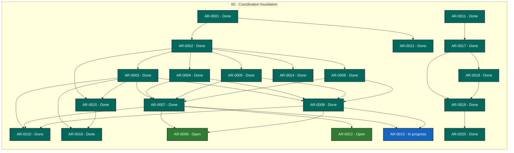

# Agent Workflow Coordinator status

> Generated deterministically from task front matter. Do not edit this file directly.
> Status records coordination progress; it is not evidence that product behavior is accepted.

## Portfolio overview

**21 ARs tracked** across 3 active status categories.

| Status | Meaning | Count |
| --- | --- | ---: |
| **In progress** | Claimed work with a live lease | 1 |
| **Open** | Dependency-ready and available to claim | 2 |
| **Blocked** | Cannot proceed until its recorded blocker clears | 0 |
| **Planned** | Defined work awaiting promotion or dependencies | 0 |
| **Future** | Deferred roadmap work | 0 |
| **Done** | Accepted, integrated, and durably verified | 18 |
| **Cancelled** | Stopped with a recorded rationale | 0 |
| **Superseded** | Replaced by another AR | 0 |

## Dependency graph

Arrows point from each prerequisite to the work that depends on it. Color is redundant
with the status text inside every node; the tables below are the complete text
alternative.

### Accessible dependency index

| AR | Prerequisites | Dependents |
| --- | --- | --- |
| [AR-0001](tasks/AR-0001.md) | None | [AR-0002](tasks/AR-0002.md), [AR-0021](tasks/AR-0021.md) |
| [AR-0002](tasks/AR-0002.md) | [AR-0001](tasks/AR-0001.md) | [AR-0003](tasks/AR-0003.md), [AR-0004](tasks/AR-0004.md), [AR-0005](tasks/AR-0005.md), [AR-0006](tasks/AR-0006.md), [AR-0014](tasks/AR-0014-verified-supersession-dependencies.md), [AR-0015](tasks/AR-0015-vendor-formal-runtime-closure.md) |
| [AR-0003](tasks/AR-0003.md) | [AR-0002](tasks/AR-0002.md) | [AR-0007](tasks/AR-0007.md), [AR-0008](tasks/AR-0008.md), [AR-0010](tasks/AR-0010.md), [AR-0015](tasks/AR-0015-vendor-formal-runtime-closure.md), [AR-0016](tasks/AR-0016-release-validation-dispatch.md) |
| [AR-0004](tasks/AR-0004.md) | [AR-0002](tasks/AR-0002.md) | [AR-0007](tasks/AR-0007.md), [AR-0008](tasks/AR-0008.md) |
| [AR-0005](tasks/AR-0005.md) | [AR-0002](tasks/AR-0002.md) | [AR-0007](tasks/AR-0007.md), [AR-0008](tasks/AR-0008.md) |
| [AR-0006](tasks/AR-0006.md) | [AR-0002](tasks/AR-0002.md) | [AR-0007](tasks/AR-0007.md), [AR-0008](tasks/AR-0008.md) |
| [AR-0007](tasks/AR-0007.md) | [AR-0003](tasks/AR-0003.md), [AR-0004](tasks/AR-0004.md), [AR-0005](tasks/AR-0005.md), [AR-0006](tasks/AR-0006.md) | [AR-0009](tasks/AR-0009.md), [AR-0010](tasks/AR-0010.md), [AR-0012](tasks/AR-0012.md), [AR-0013](tasks/AR-0013.md) |
| [AR-0008](tasks/AR-0008.md) | [AR-0003](tasks/AR-0003.md), [AR-0004](tasks/AR-0004.md), [AR-0005](tasks/AR-0005.md), [AR-0006](tasks/AR-0006.md) | [AR-0009](tasks/AR-0009.md), [AR-0010](tasks/AR-0010.md), [AR-0013](tasks/AR-0013.md) |
| [AR-0009](tasks/AR-0009.md) | [AR-0007](tasks/AR-0007.md), [AR-0008](tasks/AR-0008.md) | None |
| [AR-0010](tasks/AR-0010.md) | [AR-0003](tasks/AR-0003.md), [AR-0007](tasks/AR-0007.md), [AR-0008](tasks/AR-0008.md) | None |
| [AR-0011](tasks/AR-0011.md) | None | [AR-0017](tasks/AR-0017.md) |
| [AR-0012](tasks/AR-0012.md) | [AR-0007](tasks/AR-0007.md) | None |
| [AR-0013](tasks/AR-0013.md) | [AR-0007](tasks/AR-0007.md), [AR-0008](tasks/AR-0008.md) | None |
| [AR-0014](tasks/AR-0014-verified-supersession-dependencies.md) | [AR-0002](tasks/AR-0002.md) | None |
| [AR-0015](tasks/AR-0015-vendor-formal-runtime-closure.md) | [AR-0002](tasks/AR-0002.md), [AR-0003](tasks/AR-0003.md) | [AR-0016](tasks/AR-0016-release-validation-dispatch.md) |
| [AR-0016](tasks/AR-0016-release-validation-dispatch.md) | [AR-0003](tasks/AR-0003.md), [AR-0015](tasks/AR-0015-vendor-formal-runtime-closure.md) | None |
| [AR-0017](tasks/AR-0017.md) | [AR-0011](tasks/AR-0011.md) | [AR-0018](tasks/AR-0018.md), [AR-0019](tasks/AR-0019.md) |
| [AR-0018](tasks/AR-0018.md) | [AR-0017](tasks/AR-0017.md) | [AR-0019](tasks/AR-0019.md) |
| [AR-0019](tasks/AR-0019.md) | [AR-0017](tasks/AR-0017.md), [AR-0018](tasks/AR-0018.md) | [AR-0020](tasks/AR-0020.md) |
| [AR-0020](tasks/AR-0020.md) | [AR-0019](tasks/AR-0019.md) | None |
| [AR-0021](tasks/AR-0021.md) | [AR-0001](tasks/AR-0001.md) | None |

## Complete AR inventory

### In progress (1)

| Priority | AR | Owner | Summary | Next action |
| --- | --- | --- | --- | --- |
| P0 | [AR-0013](tasks/AR-0013.md): Selector-aware authenticated versioned runtime | codex-awc-ar0013-next-descriptor4-20260917 | PR #540 merged 368a3ccf; exact Verify 35203688204 and authoritative post-merge Verify 35204076599 succeeded on 503074bf. Descriptor3 follow-up PR #542 is published at 9c398ac. | Obtain independent exact-head review of PR #542, then dispatch exact-head pr-fast Verify; merge only after review and terminal hosted success. |

### Open (2)

| Priority | AR | Owner | Summary | Next action |
| --- | --- | --- | --- | --- |
| P0 | [AR-0009](tasks/AR-0009.md): Release integration and first upgrade | Unclaimed | PR #529 merged as 7f50b294; exact Verify 35197634079 and post-merge Verify 35198022149 succeeded. | Release completed AR-0009 and select next dependency-safe P0/P1 slice. |
| P0 | [AR-0012](tasks/AR-0012.md): Durable upgrade barrier and SQLite write fencing | Unclaimed | PR #543 merged as 9059876c after independent APPROVE and exact Verify 35204613421 success; post-merge Verify 35204995362 is pending. | Monitor post-merge Verify 35204995362 on merge head 9059876c to terminal success; then record release and reclaim next dependency-safe slice. Mutation remains disabled. |

### Done (18)

| Priority | AR | Owner | Summary | Next action |
| --- | --- | --- | --- | --- |
| P0 | [AR-0001](tasks/AR-0001.md): Integrate AWQ v0.32.0 into the coordinator | Unclaimed | Adopt AWQ v0.32.0 while retaining coordinator-native quality and formal gates. | Merged PR #20 at merge commit 713761b; post-merge AWQ PR check passes; no coordinator release was published by this merge. |
| P0 | [AR-0002](tasks/AR-0002.md): Correctness-first coordinator upgrade protocol | Unclaimed | Define a correctness-first coordinator release upgrade with verified backup and rollback. | Merged PR #21 at bd070596729949a77cfb4fae7c4230055f3f4ece. Post-merge AWQ and focused contract verification pass; no coordinator release published. AR-0011 remains the next open child. |
| P0 | [AR-0003](tasks/AR-0003.md): Release-upgrade contract and generator | Unclaimed | Generate and validate complete, bounded upgrade instructions for every release. | PR #23 at 736d2e2 is published; await exact-head verify run 34784319165 and independent review before merge. |
| P0 | [AR-0004](tasks/AR-0004.md): Quiescence and upgrade preflight | Unclaimed | Prevent upgrades from starting unless the coordination system can remain safe and functional. | AR-0004 complete; PR #24 merged and post-merge main verification green. AR-0007 is now dependency-ready for phase-machine implementation. |
| P0 | [AR-0005](tasks/AR-0005.md): Git-backend backup and restore | Unclaimed | Back up and restore complete Git-backed coordination state without losing task history. | AR-0005 complete; PR #25 merged and post-merge main verification green. AR-0006 PR #26 remains open pending independent review and exact-head checks. |
| P0 | [AR-0006](tasks/AR-0006.md): SQLite backup, migration, and restore | Unclaimed | Preserve SQLite authority and recoverability through coordinator upgrades and migrations. | AR-0006 complete; PR #26 merged and post-merge main verification green. AR-0004 remains blocked pending its correctness fixes and healthy exact-head rerun. |
| P0 | [AR-0007](tasks/AR-0007.md): Upgrade engine and rollback | Unclaimed | PR445 merged as d521ad0; post-merge Verify 35096212760 passed; worker auditing remaining AR-0007 rollback/restore gaps | Identify next non-duplicate AR-0007 contract gap beyond control-store identity tests; publish only after focused validation and independent review |
| P0 | [AR-0008](tasks/AR-0008.md): Formal upgrade and recovery model | Unclaimed | PR #323 adds RollbackRequiresBackup invariant on exact main 143bdf6; hosted Verify is pending and local TLC was blocked by pthread_create EAGAIN. | Await exact-head Verify and artifact; independently review the result before merge. Preserve bounded-model and implementation-refinement nonclaims. |
| P0 | [AR-0011](tasks/AR-0011.md): Bounded TLA+ execution and admission safety | Unclaimed | Exact-head PR #22 formal publication gate independently reviewed green. | Await parent merge decision; retain full-exhaustive claims for successful scheduled/manual run and preserve merge-tree attestation provenance. |
| P0 | [AR-0014](tasks/AR-0014-verified-supersession-dependencies.md): Verified supersession dependency readiness | Unclaimed | Make explicitly verified superseded tasks satisfy dependencies only through a completed successor. | Coordinator v0.3.6 is published and signed at a1bc4459f884ce447e8ee2884df12ea3ff4b710b. Future supersession tests/features must be added through this canonical coordinator-state handoffctl path; downstream vendor synchronization is intentionally removed. |
| P0 | [AR-0017](tasks/AR-0017.md): TLC resource-bound reliability | Unclaimed | PR #319 exact signed head 16a3549 includes capacity/preflight, timeout/doc repairs, and YAML syntax fix; Verify 35024077568 is running with AWQ/scope green and formal pending. | Await terminal Verify 35024077568 including 6000-second release-sensitive TLC, attestation and DCO; then independently review and merge only with post-merge Verify. |
| P0 | [AR-0018](tasks/AR-0018.md): Formal attestation resource-bound consistency | Unclaimed | Align formal attestation resource_bounds with the actual workflow-enforced TLC profile; prevent publication of contradictory evidence. | Implement bound derivation in attest.py, add tier-specific regression tests, publish an exact-head PR, and require green post-merge Verify. |
| P0 | [AR-0020](tasks/AR-0020.md): Correct formal tier policy for merge and advisory exhaustive runs | Unclaimed | Correct post-merge and sustained formal verification tier policy without weakening release evidence. | Correct formal tier dispatch so post-merge push verification uses required pr-fast, while scheduled and manually dispatched full-exhaustive runs remain advisory; preserve release-sensitive publication gates. |
| P1 | [AR-0010](tasks/AR-0010.md): Operational upgrade runbooks and generated release steps | Unclaimed | Make every release&#x27;s prerequisites, steps, evidence, and rollback path explicit and safe to operate. | Add targeted generator/verifier branch tests, rerun full coverage to &gt;=95&#37;, obtain new exact-head review and hosted green gates. |
| P1 | [AR-0015](tasks/AR-0015-vendor-formal-runtime-closure.md): Complete formal runtime vendor closure | Unclaimed | PR #309 merged at 6332f032b7445b8a02f60fdf99113d0d835de29e; post-merge Verify 34997001352 failed only formal evidence hash consistency: tools/handoffctl.py changed for v0.3.8 but formal/evidence.json retains prior digest. 512 tests executed; AWQ/scope passed. Existing v0.3.7 immutable tag remains untouched; no release published. | Repair formal/evidence.json using the canonical evidence generator from exact merge 6332f032; obtain independent review and green exact-head Verify, then publish signed immutable v0.3.8 targeting the repaired merge. |
| P1 | [AR-0016](tasks/AR-0016-release-validation-dispatch.md): Release validation dispatch gate | Unclaimed | Release-validation dispatch evidence is complete: merged PR #314 and successful exact-head full run on b097c757. | Release AR-0016 after recording exact PR/run/artifact evidence; retain AR-0007 open for executable rollback criteria. |
| P1 | [AR-0019](tasks/AR-0019.md): Fast merge formal tier and weekly exhaustive run | Unclaimed | Separate fast merge/commit formal checks from weekly full-exhaustive TLC without weakening release or publication evidence. | Specify and implement a bounded fast merge TLC tier, retain weekly full-exhaustive execution as advisory, and preserve release evidence requirements. |
| P1 | [AR-0021](tasks/AR-0021.md): Reconcile issue #14 with verified AWQ adoption | Unclaimed | Issue #14 reconciled: AR-0001 and PR #20 already delivered the requested artifacts and profiles using newer AWQ v0.32.0; no duplicate or downgrade was needed. | Closed issue #14 after verified supersession; retain AR-0001 as the implementation record. |
