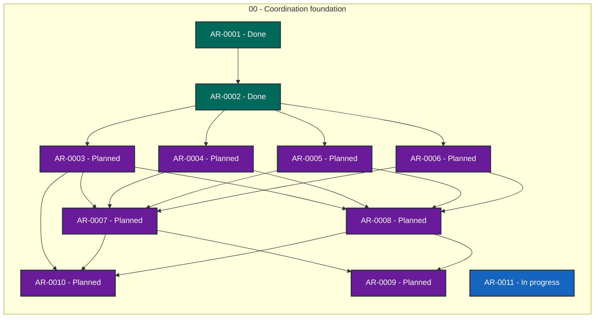

# Agent Workflow Coordinator status

> Generated deterministically from task front matter. Do not edit this file directly.
> Status records coordination progress; it is not evidence that product behavior is accepted.

## Portfolio overview

**11 ARs tracked** across 3 active status categories.

| Status | Meaning | Count |
| --- | --- | ---: |
| **In progress** | Claimed work with a live lease | 1 |
| **Open** | Dependency-ready and available to claim | 0 |
| **Blocked** | Cannot proceed until its recorded blocker clears | 0 |
| **Planned** | Defined work awaiting promotion or dependencies | 8 |
| **Future** | Deferred roadmap work | 0 |
| **Done** | Accepted, integrated, and durably verified | 2 |
| **Cancelled** | Stopped with a recorded rationale | 0 |
| **Superseded** | Replaced by another AR | 0 |

## Dependency graph

Arrows point from each prerequisite to the work that depends on it. Color is redundant
with the status text inside every node; the tables below are the complete text
alternative.

### Accessible dependency index

| AR | Prerequisites | Dependents |
| --- | --- | --- |
| [AR-0001](tasks/AR-0001.md) | None | [AR-0002](tasks/AR-0002.md) |
| [AR-0002](tasks/AR-0002.md) | [AR-0001](tasks/AR-0001.md) | [AR-0003](tasks/AR-0003.md), [AR-0004](tasks/AR-0004.md), [AR-0005](tasks/AR-0005.md), [AR-0006](tasks/AR-0006.md) |
| [AR-0003](tasks/AR-0003.md) | [AR-0002](tasks/AR-0002.md) | [AR-0007](tasks/AR-0007.md), [AR-0008](tasks/AR-0008.md), [AR-0010](tasks/AR-0010.md) |
| [AR-0004](tasks/AR-0004.md) | [AR-0002](tasks/AR-0002.md) | [AR-0007](tasks/AR-0007.md), [AR-0008](tasks/AR-0008.md) |
| [AR-0005](tasks/AR-0005.md) | [AR-0002](tasks/AR-0002.md) | [AR-0007](tasks/AR-0007.md), [AR-0008](tasks/AR-0008.md) |
| [AR-0006](tasks/AR-0006.md) | [AR-0002](tasks/AR-0002.md) | [AR-0007](tasks/AR-0007.md), [AR-0008](tasks/AR-0008.md) |
| [AR-0007](tasks/AR-0007.md) | [AR-0003](tasks/AR-0003.md), [AR-0004](tasks/AR-0004.md), [AR-0005](tasks/AR-0005.md), [AR-0006](tasks/AR-0006.md) | [AR-0009](tasks/AR-0009.md), [AR-0010](tasks/AR-0010.md) |
| [AR-0008](tasks/AR-0008.md) | [AR-0003](tasks/AR-0003.md), [AR-0004](tasks/AR-0004.md), [AR-0005](tasks/AR-0005.md), [AR-0006](tasks/AR-0006.md) | [AR-0009](tasks/AR-0009.md), [AR-0010](tasks/AR-0010.md) |
| [AR-0009](tasks/AR-0009.md) | [AR-0007](tasks/AR-0007.md), [AR-0008](tasks/AR-0008.md) | None |
| [AR-0010](tasks/AR-0010.md) | [AR-0003](tasks/AR-0003.md), [AR-0007](tasks/AR-0007.md), [AR-0008](tasks/AR-0008.md) | None |
| [AR-0011](tasks/AR-0011.md) | None | None |

## Complete AR inventory

### In progress (1)

| Priority | AR | Owner | Summary | Next action |
| --- | --- | --- | --- | --- |
| P0 | [AR-0011](tasks/AR-0011.md): Bounded TLA+ execution and admission safety | codex-awc-ar0011-tla-admission-20260913 | Prevent unbounded coordinator TLA+ jobs from exhausting shared host memory. | Obtain fresh independent review and exact-head CI for PR #22 at product commit 7092e1b; portable CI containment now uses serial GC and reserves host process headroom; verify hosted formal run. |

### Planned (8)

| Priority | AR | Owner | Summary | Next action |
| --- | --- | --- | --- | --- |
| P0 | [AR-0003](tasks/AR-0003.md): Release-upgrade contract and generator | Unclaimed | Generate and validate complete, bounded upgrade instructions for every release. | Specify the release contract schema, generator, compatibility matrix, and hostile validation fixtures. |
| P0 | [AR-0004](tasks/AR-0004.md): Quiescence and upgrade preflight | Unclaimed | Prevent upgrades from starting unless the coordination system can remain safe and functional. | Specify quiescence, prerequisite, admission, and reopen invariants with negative-path tests. |
| P0 | [AR-0005](tasks/AR-0005.md): Git-backend backup and restore | Unclaimed | Back up and restore complete Git-backed coordination state without losing task history. | Define verified Git backup artifacts, restore ordering, and fault-injection coverage. |
| P0 | [AR-0006](tasks/AR-0006.md): SQLite backup, migration, and restore | Unclaimed | Preserve SQLite authority and recoverability through coordinator upgrades and migrations. | Specify SQLite backup, migration, selector, integrity, and restore invariants with crash tests. |
| P0 | [AR-0007](tasks/AR-0007.md): Upgrade engine and rollback | Unclaimed | Execute upgrades atomically and restore the known-good runtime on every failure path. | Implement the phase machine and explicit rollback commands only after contract and backend children are accepted. |
| P0 | [AR-0008](tasks/AR-0008.md): Formal upgrade and recovery model | Unclaimed | Formally verify upgrade safety, crash recovery, rollback, and functional reopen conditions. | Model upgrade and rollback invariants and bind them to exhaustive bounded implementation tests. |
| P0 | [AR-0009](tasks/AR-0009.md): Release integration and first upgrade | Unclaimed | Publish and exercise generated upgrade paths for every release without sacrificing recoverability. | Add release CI generation, publication evidence, and the first independently reviewed upgrade campaign. |
| P1 | [AR-0010](tasks/AR-0010.md): Operational upgrade runbooks and generated release steps | Unclaimed | Make every release&#x27;s prerequisites, steps, evidence, and rollback path explicit and safe to operate. | Generate release-specific operator and agent upgrade/rollback runbooks and privacy-test them. |

### Done (2)

| Priority | AR | Owner | Summary | Next action |
| --- | --- | --- | --- | --- |
| P0 | [AR-0001](tasks/AR-0001.md): Integrate AWQ v0.32.0 into the coordinator | Unclaimed | Adopt AWQ v0.32.0 while retaining coordinator-native quality and formal gates. | Merged PR #20 at merge commit 713761b; post-merge AWQ PR check passes; no coordinator release was published by this merge. |
| P0 | [AR-0002](tasks/AR-0002.md): Correctness-first coordinator upgrade protocol | Unclaimed | Define a correctness-first coordinator release upgrade with verified backup and rollback. | Merged PR #21 at bd070596729949a77cfb4fae7c4230055f3f4ece. Post-merge AWQ and focused contract verification pass; no coordinator release published. AR-0011 remains the next open child. |
